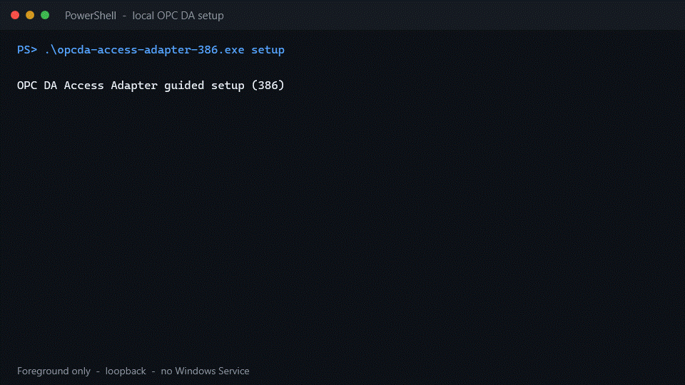

# OPC DA Access Adapter

[](https://github.com/east-true/opcda-access-adapter/actions/workflows/ci.yml)
[](https://github.com/east-true/opcda-access-adapter/actions/workflows/real-da-validation.yml)
[](LICENSE)

A thin Windows adapter that gives modern applications HTTP/JSON, typed gRPC,
or OPC UA access to one local OPC DA server—without making DA-native clients
speak COM or silently rewriting source semantics.

[Quick start](#quick-start) · [Interfaces](#choose-an-interface) ·
[Compatibility](#compatibility) · [Documentation](docs/README.md) ·
[Contributing](CONTRIBUTING.md) · [Security](SECURITY.md)

> [!IMPORTANT]
> This is a Windows-only, pre-1.0 project for controlled local-COM
> deployments. The scoped implementation is complete and tested, but there is
> no stable binary release and no broad vendor or production-readiness claim.
> Build from source and review the [compatibility evidence](docs/compatibility.md)
> before deploying it.

## What it does

OPC DA normally requires a Windows process that understands COM and the
vendor's server registration. This adapter keeps that legacy boundary on the
DA host and exposes one explicitly selected frontend:

```text
HTTP / gRPC / OPC UA client
            │
            ▼
   one bounded frontend
            │
            ▼
 dedicated COM-owning thread
            │ local COM
            ▼
    one OPC DA server
```

The adapter preserves exact ItemIDs, VARTYPEs, raw Quality, source timestamp
presence, HRESULTs, access rights, and per-item errors. It does not rename
tags, scale values, invent timestamps, return cached last-good data, or store
process values.

| | Current scope |
|---|---|
| Source | Exactly one local OPC DA 2.05a server per process |
| Frontend | Exactly one of HTTP/JSON, typed gRPC, or OPC UA |
| Operations | Browse, device Read, strict typed Write, item properties; Subscribe over gRPC and OPC UA |
| Platform | Native Windows `386` and `amd64` |
| Execution | Foreground process or SCM-managed `LocalService` |
| Safe defaults | Loopback listeners; Write disabled |
| Distribution | Source only; no stable release or bundled OPC server |

## Quick start

You need Windows, an installed local OPC DA server, Git, and the Go version
declared in [`go.mod`](go.mod). The adapter architecture must match the
server's COM registration.



This 12-second demo is a sanitized replay of the executed `windows/386`
Graybox setup recorded in the [compatibility evidence](docs/compatibility.md).
It starts a foreground loopback listener with Write disabled; it does not
install a Windows Service. The same steps are available as copyable text below.
If your Markdown viewer honors reduced-motion settings and shows a still image,
[open the animation directly](docs/assets/setup-demo.gif).

### 1. Build

```powershell
git clone https://github.com/east-true/opcda-access-adapter.git
Set-Location opcda-access-adapter
go build -trimpath -o opcda-access-adapter.exe ./cmd/adapter
```

For a 32-bit-only registration, build the x86 executable instead:

```powershell
$env:GOARCH = "386"
go build -trimpath -o opcda-access-adapter-386.exe ./cmd/adapter
Remove-Item Env:GOARCH
```

A 64-bit executable cannot see a 32-bit-only COM registration. If the server
bitness is unknown, run `detect` with both builds.

### 2. Inspect local registrations

```powershell
.\opcda-access-adapter.exe detect
```

Detection returns a bounded JSON inventory of local OPC DA 2.0 registrations.
It does not activate a vendor server, select one automatically, change
configuration, or search remote machines. An empty list is a successful
result. See [local server detection](docs/local-detection.md).

### 3. Configure and run

```powershell
.\opcda-access-adapter.exe setup
```

The guided flow requires four explicit decisions:

1. choose one detected source;
2. choose HTTP, gRPC, or OPC UA;
3. choose foreground, Windows Service, or save-only execution;
4. review the exact configuration before it is written or started.

For the shortest first run, choose **HTTP/JSON** and **current terminal**.
HTTP listens on `127.0.0.1:8080` by default and Write remains disabled. Setup
never silently overwrites a file or service and never changes COM/DCOM or
firewall permissions.

### 4. Check status

```powershell
Invoke-RestMethod http://127.0.0.1:8080/v1/status
```

The response should name the selected source and eventually report
`connected`. A registration discovered by `detect` is not proof that the
vendor server can activate under the current Windows identity.

### 5. Read a known ItemID

```powershell
$body = @{
    source = "device"
    items  = @(@{ itemId = "Vendor.Example.Item" })
} | ConvertTo-Json -Depth 4

Invoke-RestMethod `
    -Method Post `
    -Uri http://127.0.0.1:8080/v1/read `
    -ContentType application/json `
    -Body $body
```

Use the exact ItemID accepted by the source. Browse is optional in OPC DA;
known-ItemID Read remains available when the source does not support Browse.

For service installation, saved configurations, OPC UA identity fields, and
the original environment-variable workflow, continue with the
[setup and Windows Service guide](docs/setup.md).

## Choose an interface

Only one frontend runs in an adapter process.

| Frontend | Best fit | Surface | Security boundary |
|---|---|---|---|
| [HTTP/JSON](docs/http-api.md) | Scripts and simple integrations | Status, Browse, Read, Write, item properties | Loopback by default; no built-in TLS or authentication |
| [Typed gRPC](docs/grpc-api.md) | Generated clients and DA-native streaming | HTTP surface plus server-streaming Subscribe | Plaintext loopback by default; no built-in TLS or authentication |
| [OPC UA](docs/opcua-mapping.md) | Local UA interoperability work | Browse, Read, Write, Subscriptions, DA-to-UA properties | `SecurityPolicy None` only; anonymous, unsigned, unencrypted, not production ready |

The authoritative gRPC contract is
[`api/opcda/v1/opcda_access.proto`](api/opcda/v1/opcda_access.proto). HTTP does
not expose Subscribe. OPC UA is a deliberately bounded frontend, not a general
UA server or a conformance claim.

## Design guarantees

- **DA-native identity.** ItemIDs and source metadata are returned as supplied.
- **Explicit partial failure.** Batch results remain ordered and carry their
  own HRESULT or adapter error.
- **No silent type conversion.** Write is value-only, strictly typed, disabled
  by default, and never retried or replayed.
- **No stale fallback.** Disconnect invalidates source handles and pending
  subscription values; clients must resubscribe explicitly.
- **COM ownership stays local.** DA pointers and cleanup remain on a dedicated,
  locked OS thread.
- **Bounded work.** Request sizes, batches, Browse depth/results, connections,
  subscriptions, concurrency, and timeouts have explicit ceilings.
- **No process-value storage.** Values are neither persisted nor logged by
  default.

The full invariants and rationale live in the
[design baseline](docs/design.md) and [architecture decisions](docs/adr/).

## Deliberate non-goals

This project is not a general industrial gateway. It does not provide:

- remote DCOM or remote server discovery;
- aggregation of multiple DA servers in one process;
- tag mapping, renaming, scaling, normalization, or a common asset model;
- process-value persistence or historical storage;
- automatic source selection, transparent resubscription, or last-good data;
- a plugin framework or non-DA source protocols;
- production authentication, authorization, TLS, or OPC UA security modes
  other than `None`.

These boundaries are part of the correctness model, not a feature backlog.

## Safety and deployment

- All listeners bind to loopback by default.
- HTTP loopback mode rejects non-loopback Host values and direct browser Origin
  requests; POST endpoints require JSON.
- External binds require a separate network and authorization boundary.
- A Windows Service runs as `NT AUTHORITY\LocalService`, not LocalSystem, and
  does not change DCOM permissions.
- A vendor that works for an interactive user may still reject LocalService
  through its own AppID, RunAs, or DCOM policy.
- Suspected vulnerabilities belong in a private GitHub security advisory, not
  a public issue. See [SECURITY.md](SECURITY.md).

## Compatibility

The automated real-DA workflow validates the pinned OPC Foundation DA 2.05a
fixture on both `windows/386` and `windows/amd64`, including Browse, partial
Read, strict typed and denied Write, Subscribe, reconnect, guided setup,
Windows Service lifecycle, and bounded stability scenarios.

One operator-supplied x86 Graybox Gray Simulator 1.7.9.701 installation also
passed a bounded manual run through the DA core, HTTP, gRPC unary/streaming,
and read-only OPC UA paths. That is evidence for that exact installation, not
for every Graybox copy or other vendor.

Three third-party UA clients—asyncua, open62541, and the OPC Foundation .NET
stack—run against the UA frontend in CI. This is interoperability evidence,
not OPC UA certification or conformance.

See the [compatibility matrix](docs/compatibility.md) for exact workflow runs,
source pins, observed metadata, resource deltas, and untested conditions.

## Command reference

| Command | Purpose |
|---|---|
| `opcda-access-adapter setup` | Select, review, save, and optionally start one configuration |
| `opcda-access-adapter detect` | Inventory bounded local OPC DA 2.0 registrations without activation |
| `opcda-access-adapter run --config FILE` | Run a reviewed configuration in the current terminal |
| `opcda-access-adapter service install --config FILE` | Install and start an SCM-managed LocalService instance |
| `opcda-access-adapter service uninstall` | Stop and remove the configured Windows Service |
| `opcda-access-adapter` | Run the environment-variable workflow in the foreground |
| `opcda-access-adapter --version` | Print version and source revision metadata |

Use `--help` on a command for its complete options and bounds.

## Documentation

Start at the [documentation index](docs/README.md), which groups material by
task:

- **Use:** [setup](docs/setup.md),
  [local detection](docs/local-detection.md)
- **Integrate:** [HTTP API](docs/http-api.md),
  [gRPC API](docs/grpc-api.md),
  [OPC UA mapping](docs/opcua-mapping.md)
- **Operate safely:** [Windows COM security](docs/security-windows.md),
  [real-DA validation](docs/validation/real-da-windows.md)
- **Understand the project:** [design](docs/design.md),
  [ADRs](docs/adr/), [implementation status](docs/implementation-status.md)
- **Evaluate evidence:** [compatibility](docs/compatibility.md),
  [benchmarks](docs/validation/benchmarks.md),
  [UA client interoperability](docs/validation/ua-client-interop.md)

## Contributing

Issues, documentation improvements, tests, and focused pull requests are
welcome when they preserve the project's DA-only boundary. Read
[CONTRIBUTING.md](CONTRIBUTING.md) for the development workflow and
[docs/design.md](docs/design.md) for the invariants that changes must keep.

For reproducible bugs, use the
[bug report form](https://github.com/east-true/opcda-access-adapter/issues/new?template=bug_report.yml).
For an in-scope proposal, use the
[feature request form](https://github.com/east-true/opcda-access-adapter/issues/new?template=feature_request.yml).
Do not include process values, credentials, or proprietary server data.

## Support and security

Use existing documentation and issues for public support. The project does
not currently offer a dedicated forum or paid support channel.

Report vulnerabilities privately as described in [SECURITY.md](SECURITY.md).

## License

Licensed under the [Apache License 2.0](LICENSE). Third-party notices are in
[THIRD_PARTY_NOTICES.md](THIRD_PARTY_NOTICES.md).
